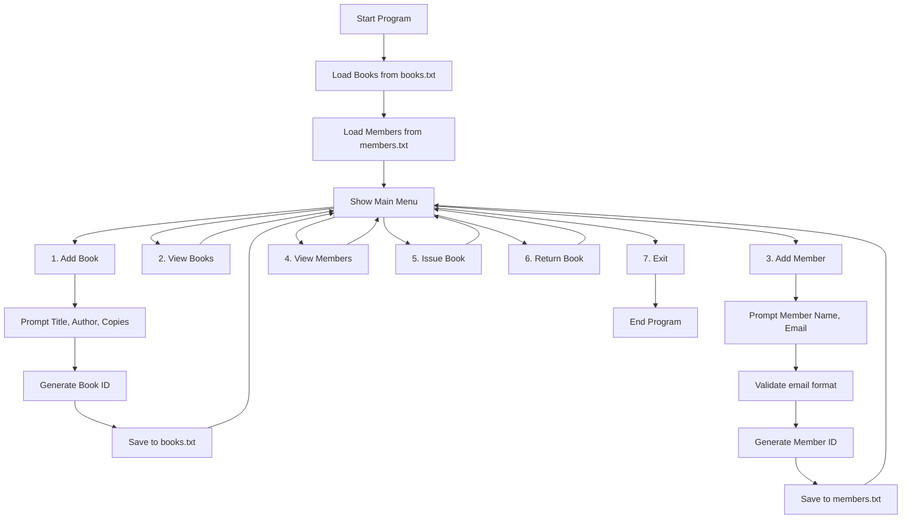
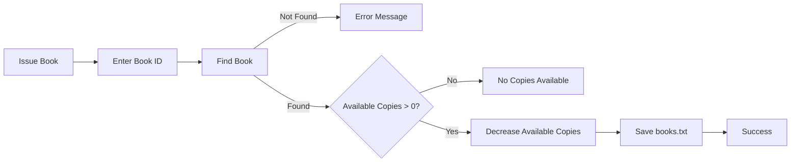

# Library Management System (C++)

A **menu-based Library Management System** built in C++ that manages books, members, book issuing, and book returning.  
Data is stored using text files; IDs are generated automatically starting from 100001.

---

## Key Features

- **Add Book**  
  User enters:
  - Book title  
  - Book author  
  - Total copies  
  The system **automatically assigns a unique Book ID** and initializes available copies.

- **Add Member**  
  User enters:
  - Member name  
  - Member email (validated: exactly one `@` and ending in `.com`)  
  The system **automatically assigns a unique Member ID**.

- **View Books & Members**  
  - Displays all stored entries in a structured list.

- **Issue Book**  
  - Decreases available copies if stock exists.

- **Return Book**  
  - Increases available copies up to total copies.

- **Exit**  
  - Closes the program and ensures all data is saved.
---

## Program Workflow



## Flowchart

### Book Management Logic


### Member Registration Logic


### Book Issuing Logic


---

## Menu Overview

```markdown
1. Add Book
2. View Books
3. Add Member
4. View Members
5. Issue Book
6. Return Book
7. Exit
```
---

## Data File Structure
### books.txt:
```makefile
ID: 100001
Title: The Alchemist
Author: Paulo Coelho
Available: 3
Total: 3
--------------------------------------------------
```

### members.txt:
```makefile
ID: 100001
Name: Alice Johnson
Email: alice@example.com
------------------------------
```
---

## Example Console Output
```mathematica
Enter Book Title: The Alchemist
Enter Book Author: Paulo Coelho
Enter Total Copies: 3
Book is added with ID 100001 successfully!
```
---

## Viewing Books
```yaml
ID: 100001, Title: The Alchemist, Author: Paulo Coelho, Available: 3, Total: 3
```
---

## How to Run

- Compile:
```css
g++ main.cpp -o library
```
- Run:
```bash
./library
```
---

## Data Validation

✔ Positive integers only for copies  
✔ Email must contain **exactly one** `@`  
✔ Email must end with **.com**  
✔ No empty names or titles  
✔ Menu accepts **1–7 only**
---

## Future Improvements

- Web version
  - Currently working on how to improve web version; will be available in the exhibition on Dec 4<sup>th</sup>.
- Telegram bot version
  - Currently working on how to improve web version; will be available in the exhibition on Dec 4<sup>th</sup>.
---

## Quick Info

The <ins>project</ins> is done by ***Shukurullo Abdusattorov*** and ***Maruf Halilov*** for the _project_ of first semester of freshmen year at **Central Asian University** (**CAU**). 


